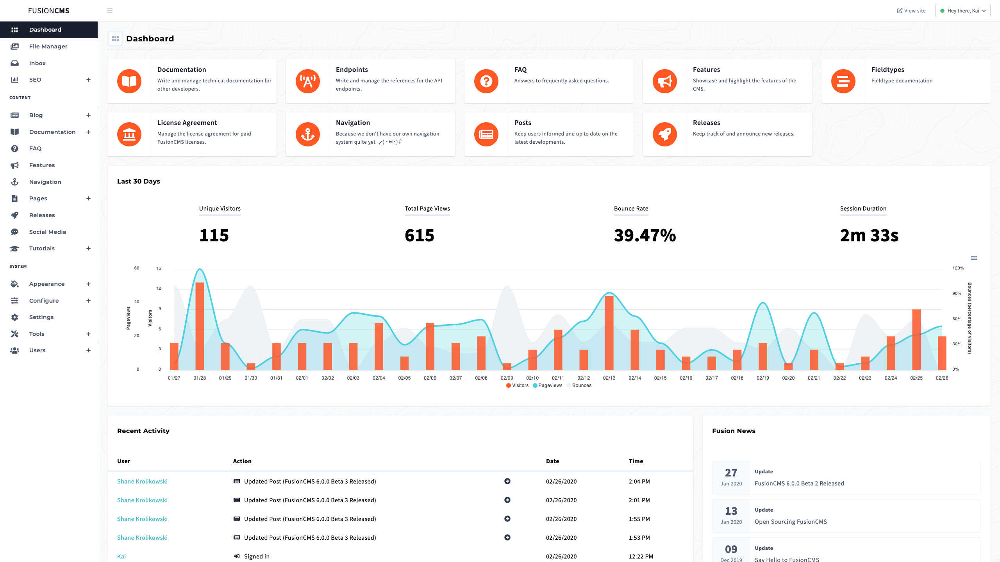

<h1>FusionCMS</h1>

**FusionCMS** is an open source, modern, intuitive, and flexible content management system (CMS) built on the Laravel framework developed in Seattle, WA by [efelle creative](https://seattlewebdesign.com).

Modular at heart, FusionCMS provides the necessary launching platform to build out any type of web or mobile application. It's intuitive and easy for content editors to use on a daily basis, while still maintaining the power and flexibility for developers and designers to dig into the heart of the platform to build and design whatever comes to mind.

## Documentation
You will find robust, user friendly, and updated [documentation](https://beta.getfusioncms.com/docs) on our website. Some pages of interest to get started with are:

- [Requirements](https://beta.getfusioncms.com/docs/requirements)
- [Installing](https://beta.getfusioncms.com/docs/installing)
- [Introduction To Themes](https://beta.getfusioncms.com/docs/themes)

## Versioning
We use [SemVer](http://semver.org/) for versioning. For the versions available, see the [tags on this repository](https://github.com/fusioncms/fusioncms/tags).

## Contributing
Thank you for considering contributing to FusionCMS! The contribution guide can be found in the [CONTRIBUTING.md](CONTRIBUTING.md) file here in the repository.

## Security Vulnerabilities
If you discover a security Vulnerability within FusionCMS, please send a message to **Kai** on our Discord server. All security vulnerabilities will be promptly addressed.

## License
FusionCMS is licensed under the MIT License - see the [LICENSE.md](LICENSE.md) file for details.
